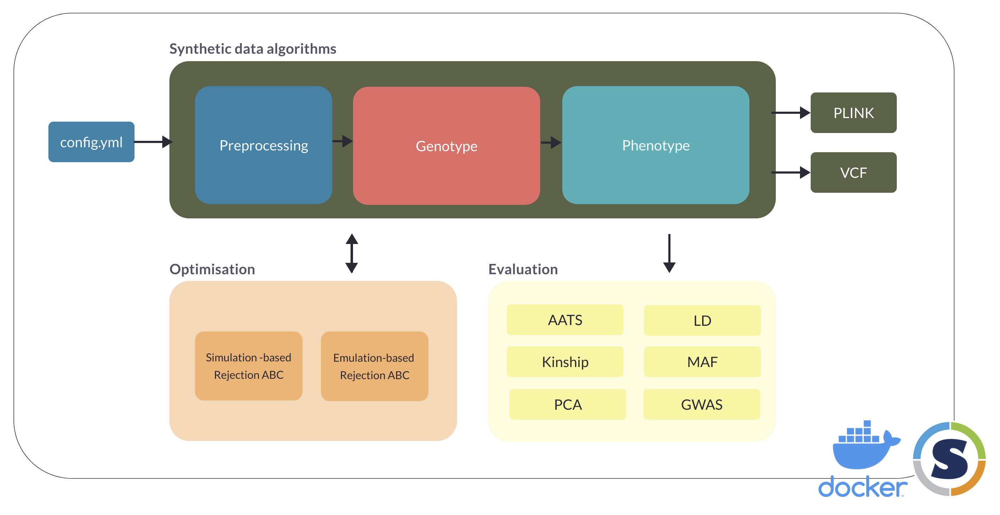

# Synthetic data generator for genotypes and phenotypes

Software program for generating large and realistic genotype+phenotype datasets. 



## Quickstart


## Overview

The software program implements a pipeline for generating synthetic genotype+phenotype datasets, with the following capabilities:

- **Data pre-processing**: Code for pre-processing the inputs needed for synthetic data generation. This takes a while to run, so we provide the option of using a set of inputs that are already pre-processed.
- **Genotype and phenotype generation**: Algorithms for generating synthetic datasets - see our paper for a detailed description of the methodology. The genotype dataset is generated first, which is then used to generate the corresponding phenotypes. Users can choose from the PLINK (bed/bim/fam) or VCF output formats.
- **Evaluation**: Quantitative metrics and visualisations for evaluating synthetic data quality. This code can be run after a synthetic dataset is generated.
- **Optimisation**: Likelihood-free inference techniques for selecting the optimal algorithm parameters. Users generating synthetic datasets will not need to run this, as we've already set the optimal values as the default in the configuration.

## Detailed configuration

Synthetic datasets can be generated with the default configuration. Detailed guidance is provided here for users who want to customize their synthetic datasets by modifying the `config.yml` file.

### Global parameters

The global parameters are used by all pipeline components:

| Parameter name | Possible values | Description |
| --- | --- | --- |
| `random_seed` | Numerical value, e.g. 123 | A random seed used for reproducibility |
| `chromosome` | `all` or a numerical value between 1 and 22 | Set to a numerical value between 1 and 22 if running the pipeline for a specific chromosome. Otherwise, set to `all` | 
| `superpopulation` | `none` or one of `AFR`, `AMR`, `EAS`, `EUR`, `SAS` | This parameter is ignored if using a custom population structure |

### Filepaths

The `{chromosome}` and `{superpopulation}` wildcards can be specified in the filepath strings (some files actually require this). The program will substitute the corresponding values given in the global parameters.

The filepaths are divided into 4 subsections:

#### General filepaths

Filepaths that are used by multiple pipeline components:

| Parameter name | Possible values | Description |
| --- | --- | --- |
| `output_dir` | String value | Directory for synthetic data outputs, e.g.  "data/outputs/test" |
| `output_prefix` | String value | Prefix for synthetic data outputs, e.g. "test{chromosome}" |

#### Genotype filepaths

Filepaths that are used for generating genotypes:

| Parameter name | Possible values | Description |
| --- | --- | --- |
| `vcf_input_raw` | String | VCF files for the (real) reference dataset, before pre-processing |
| `vcf_input_processed` | String | VCF files for the (real) reference dataset, created by pre-processing |
| `vcf_metadata` | String | Text file describing metadata for the VCF reference such as name of SNPs |
| `popfile_raw` | String | Population file for the reference VCF, before pre-processing |
| `popfile_processed` | String | Population file for the reference VCF, created by pre-processing |
| `variant_list` | String | List of variants to include in synthetic dataset |
| `genetic_mapfile` | String | Genetic maps for converting basepair to centimorgan distances |
| `genetic_distfile` | String | A genetic map created by the pre-processing code |
| `hap1_matrix` | String | A data structure for the reference data haplotypes created by the pre-processing code |
| `hap2_matrix` | String | A data structure for the reference data haplotypes created by the pre-processing code |

#### Phenotype filepaths

Filepaths that are used for generating phenotypes:

| Parameter name | Possible values | Description |
| --- | --- | --- |
| `causal_list` | String | See phenotype algorithm [documentation](algorithms/phenotype/README.md) |
| `reference_list` | String | See phenotype algorithm [documentation](algorithms/phenotype/README.md) |

#### Software filepaths

Filepaths for external software programs:

| Parameter name | Possible values | Description |
| --- | --- | --- |
| `plink` | String | Software path |
| `plink2` | String | Software path |
| `king` | String | Software path |
| `vcftools` | String | Software path |
| `mapthin` | String | Software path |
| `phenoalg` | String | Software path (our own phenotype algorithm) |

### Genotype data

There are 3 ways of generating synthetic data (in order from simple to more custom):

1. Single population group: Generate `n` samples for a specific population group, e.g. European `EUR`
    - Set `global_parameters` > `superpopulation` to the desired population
    - Set `genotype_data` > `samples` > `default` to `true` (all values under `genotype_data` > `samples` > `custom` will be ignored by the algorithm)
    - Set `genotype_data` > `default` > `nsamples` to the number of samples you want to generate
2. Multiple population groups, with default population structure: Generate `n` samples for multiple ancestries, using the default population structure (similar to the 1000 Genomes dataset)
    - Same as for 1, but set `global_parameters` > `superpopulation` to `none`
3. Custom population structure: Generate a dataset with fully customizable population structure and admixture
    - Set `genotype_data` > `samples` > `default` to `false`
    - The algorithm will ignore the value of the `global_parameters` > `superpopulation` parameter
    - See the section on [configuring custom population structure](#configuring-custom-population-structure) for how to define population structure and admixture

| Parameter name | Possible values | Description |
| --- | --- | --- |
| `filetype` | `plink` or `vcf` | Choose to output the genotype data in the PLINK (bed/bim/fam) or VCF format. PLINK is recommended because it is much faster to generate. |
| `samples` | Various | See instructions given above for detailed guidance on how to configure this, based on your use case. |
| `rho` | Numerical | Recombination rate parameters for each superpopulation. Default values were set according to our optimisation algorithm. |
| `Ne` | Numerical | Effective population size parameters for each superpopulation. Default values were set according to our optimisation algorithm. |

#### Configuring custom population structure

Customise population structure/admixture of the synthetic data by creating your own population groups. You can add as many groups as you want (see the default `config.yml` for an example of how this is formatted). 

For each population group, you need to specify:
- `id`: a name for your custom population group, e.g. `pop1`
- `nsamples`: the number of samples you want to generate for this population group, e.g. 100
- `populations`: the population structure/admixture composition for the population group, as a list of population codes (AFR, AMR, EAS, EUR, SAS) that you want to include, and their admixture proportions (which must sum to 100)

For example, if you want to generate 100 genotypes with EUR ancestry and 200 genotypes with AFR ancestry, you could write

```{yaml}
- id: EUR_pop
  nsamples: 100
  populations:
    - EUR: 100
- id: AFR_pop
  nsamples: 200
  populations:
    - AFR: 100
```

Or, if you wanted 100 admixed genotypes where each genotype is composed of 50% EUR ancestry and 50% AFR ancestry, you could write

```{yaml}
- id: admix_pop
  nsamples: 100
  populations:
    - EUR: 50
    - AFR: 50
```

See [here](algorithms/genotype/poplist.md) for a list of population codes.


### Phenotype data

See the [documentation](algorithms/phenotype/README.md) about the inputs for the phenotype algorithm.

### Evaluation

Specify which evaluation metrics to use:

| Parameter name | Possible values | Description |
| --- | --- | --- |
| `aats` | true/false | Nearest neighbour adversarial accuracy |
| `kinship` | true/false | Kinship-based relatedness metrics |
| `ld` | true/false | Linkage disequilibirum |
| `maf` | true/false | Minor allele frequency divergences |
| `pca` | true/false | Principal components analysis (population structure) |
| `gwas` | true/false | Run GWAS and generate manhattan and qqplot (note that this requires both genotype and phenotype synthetic data) |

Note that some metrics can be slow for large datasets (e.g. `aats`, `kinship`).

### Optimisation

Configuration for the likelihood-free inference optimisation procedure:

| Parameter name | Possible values | Description |
| --- | --- | --- |
| `priors` | Numerical values for `uniform_lower` and `uniform_upper` of each parameter | Uniform distributions are used for the priors. Configure the lower and upper bounds for each parameter, i.e. a and b in Uniform(a,b). |
| `simulation_rejection_ABC` | Set the `run` value to `true` if using this algorithm. For information about other parameters, see the documentation for the [GpABC](https://github.com/tanhevg/GpABC.jl) Julia package. | In simulation-based rejection ABC, a synthetic dataset is simulated at each step. This is computationally expensive for large datasets. |
| `emulation_rejection_ABC` | Set the `run` value to `true` if using this algorithm. For information about other parameters, see the documentation for the [GpABC](https://github.com/tanhevg/GpABC.jl) Julia package. | In emulation-based rejection ABC, a small number of synthetic datasets are simulated to train a GP regression model that is used to approximate the ABC results. Therefore, emulation-based rejection ABC is more suitable for computationally expensive simulations. |
| `summary_statistics` > `ld_decay` | true/false | This statistic aims to find model parameters that generate synthetic datasets with LD (linkage disequilibrium) decay curves as similar as possible to the (real) reference dataset. |
| `summary_statistics` > `kinship` | true/false | This statistic aims to find model parameters that generate synthetic datasets with relatedness (proportion of twins, 1st degree, 2nd degree relatives) as similar as possible to the (real) reference dataset. |


## Code contributors

* Sophie Wharrie (sophie.wharrie@aalto.fi)
* Vishnu Raj (vishnu.raj@aalto.fi)
* Zhiyu Yang (zhiyu.yang@helsinki.fi)

This work is part of the [INTERVENE project](https://www.interveneproject.eu/).

## Cite as

Link to publication here.

## Acknowledgments

* Acknowledgments for data, code, etc.

## License

This project is licensed under the MIT License - see the [LICENSE.md](LICENSE.md) file for details.
